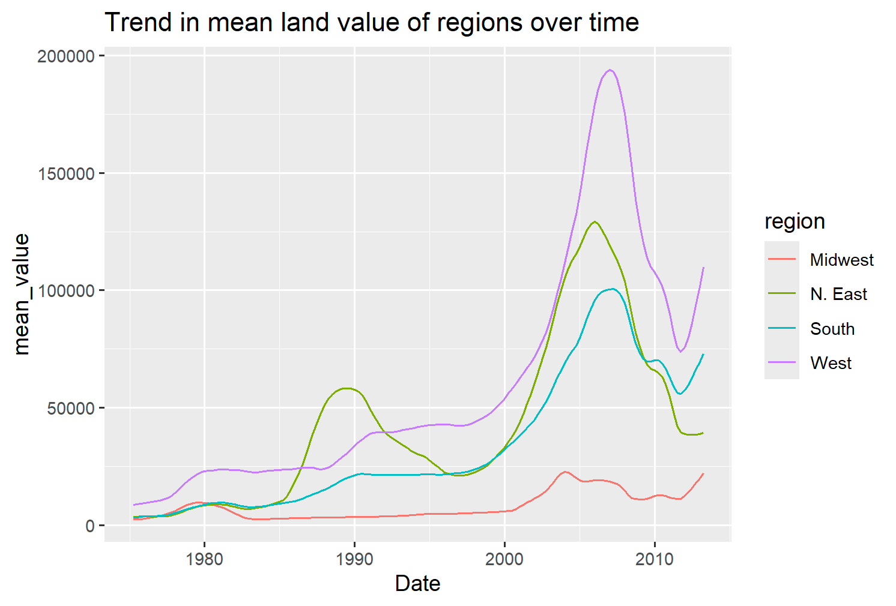
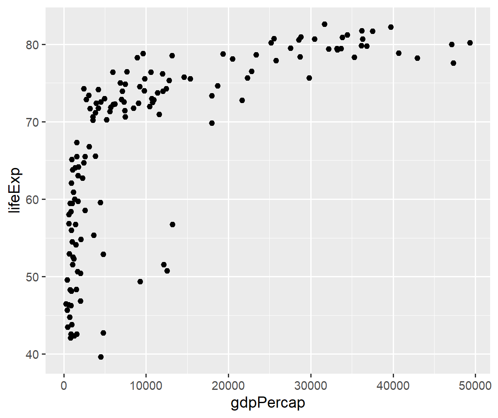
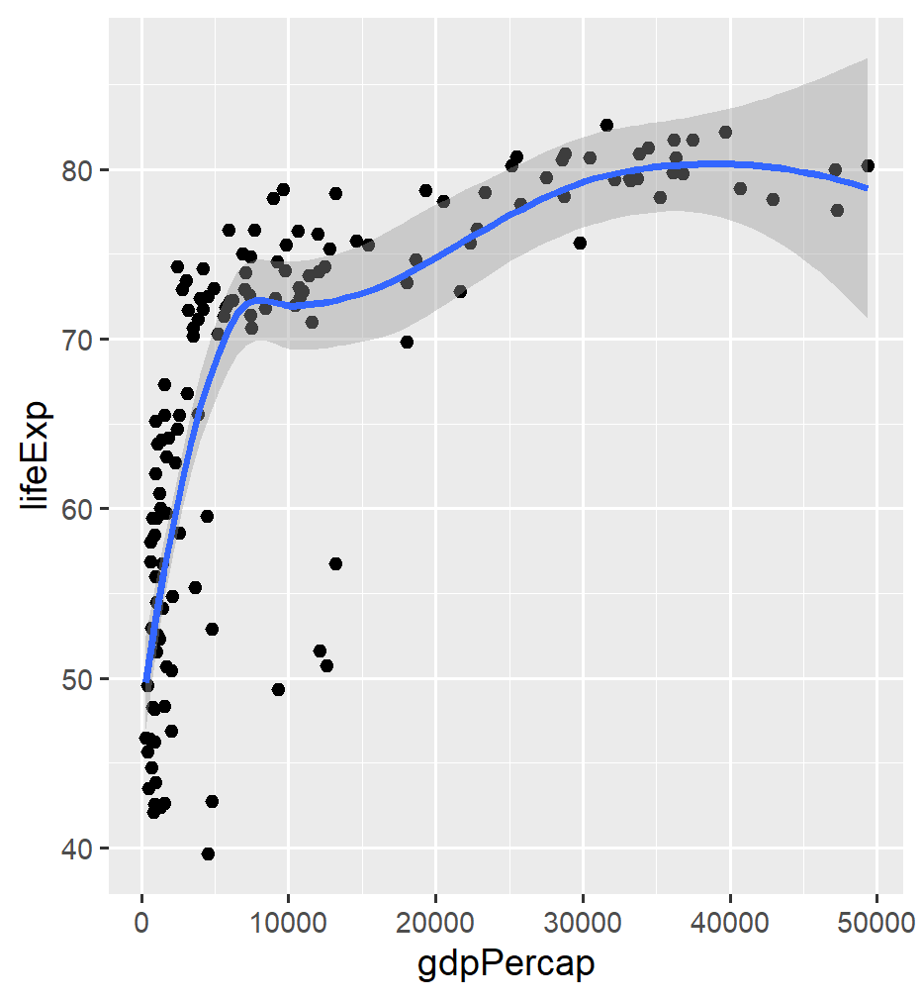
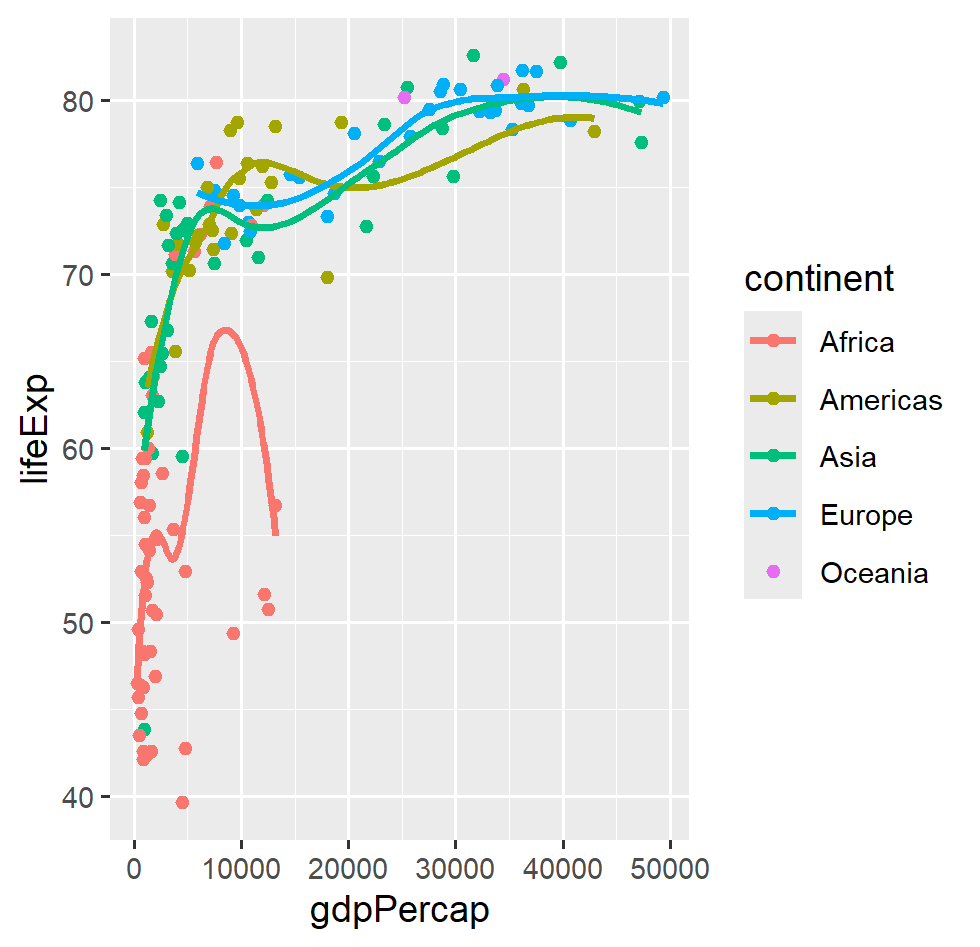
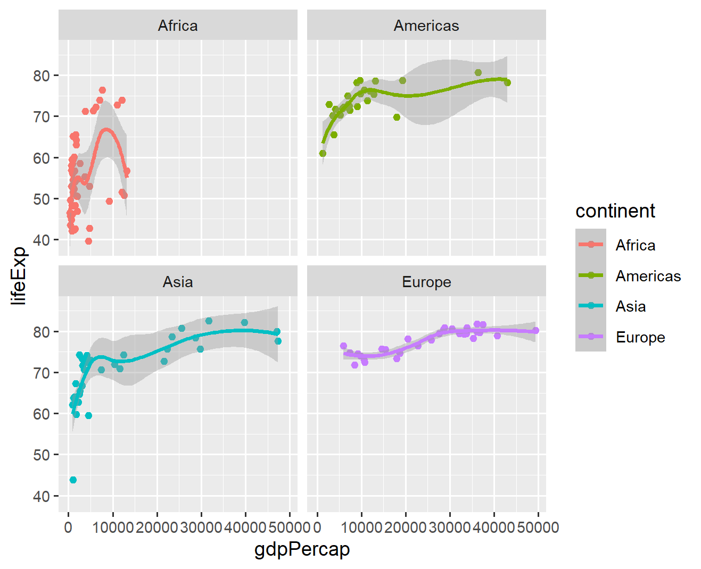
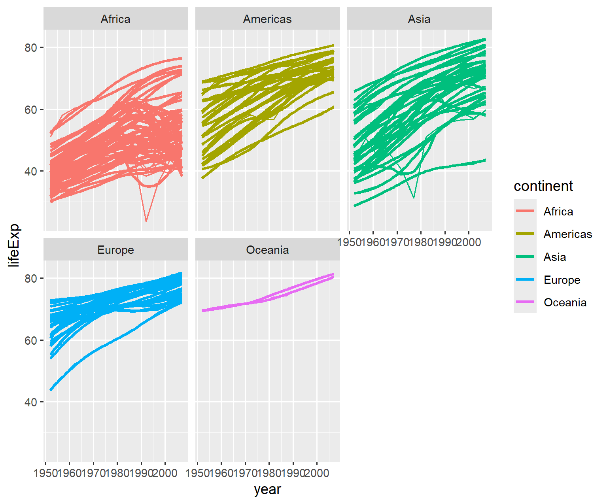

Assignment 5: Data Visualization and Transformation Part 2

by Patrick Gritton

------------------------------------------------------------------------

First, load all the required packages with the following code, installing the packages if they are not installed already

``` r
install.packages('tidyverse')
install.packages('knitr')
install.packages('gapminder')
library(tidyverse)
library(knitr)
library(gapminder)
```

Exersize 1- Trends in Land Value

This excercise uses a dataset that describes the trends in land value (`Land.Value`), among other variables, in different states in the US 1975-2013. The states are grouped into four different regions, under the variable `region`. This dataset was obtained from the Data Science Services of Harvard University.

``` r
housing <- read_csv("https://raw.githubusercontent.com/nt246/NTRES-6100-data-science/master/datasets/landdata_states.csv")

housing |> 
  head() |>  
  kable() 
```

| State | region | Date | Home.Value | Structure.Cost | Land.Value | Land.Share..Pct. | Home.Price.Index | Land.Price.Index | Year | Qrtr |
|:------|:------|------:|------:|------:|------:|------:|------:|------:|------:|------:|
| AK | West | 2010.25 | 224952 | 160599 | 64352 | 28.6 | 1.481 | 1.552 | 2010 | 1 |
| AK | West | 2010.50 | 225511 | 160252 | 65259 | 28.9 | 1.484 | 1.576 | 2010 | 2 |
| AK | West | 2009.75 | 225820 | 163791 | 62029 | 27.5 | 1.486 | 1.494 | 2009 | 3 |
| AK | West | 2010.00 | 224994 | 161787 | 63207 | 28.1 | 1.481 | 1.524 | 2009 | 4 |
| AK | West | 2008.00 | 234590 | 155400 | 79190 | 33.8 | 1.544 | 1.885 | 2007 | 4 |
| AK | West | 2008.25 | 233714 | 157458 | 76256 | 32.6 | 1.538 | 1.817 | 2008 | 1 |

1.1

``` r
view(housing)

housing1.1 <- housing |> 
select(State,region, Date, Land.Value) |> 
  mutate(region = ifelse(State == "DC", "South", region)) |> 
  filter(State == 'DC')
```

``` r
housing1.1 |> 
head() |> 
kable()
```

| State | region |    Date | Land.Value |
|:------|:-------|--------:|-----------:|
| DC    | South  | 2003.00 |     290522 |
| DC    | South  | 2003.25 |     305673 |
| DC    | South  | 2003.50 |     323078 |
| DC    | South  | 2003.75 |     342010 |
| DC    | South  | 2004.00 |     361999 |
| DC    | South  | 2004.25 |     382792 |

1.2

``` r
housing1.2.0 <- housing |> 
select(State,region, Date, Land.Value) |> 
  mutate(region = ifelse(State == "DC", "South", region))
  
housing1.2.1 <- housing1.2.0 |> 
group_by(region, Date) |> 
summarize(
mean_value = mean(Land.Value) |> 
)
housing1.2.1 |> 
head() |> 
kable()
```

| region  |    Date | mean_value |
|:--------|--------:|-----------:|
| Midwest | 1975.25 |   2452.167 |
| Midwest | 1975.50 |   2498.917 |
| Midwest | 1975.75 |   2608.167 |
| Midwest | 1976.00 |   2780.000 |
| Midwest | 1976.25 |   2967.333 |
| Midwest | 1976.50 |   3212.833 |

1.3

``` r
library(ggplot2)

housing1.2.1 |> 
ggplot(aes(x = Date, y = mean_value, color = region)) +
geom_line() +
ggtitle('Trend in mean land value of regions over time')
```



------------------------------------------------------------------------

Exersize 2- Life expectancy and GDP per capita 1952-2007

``` r
gapminder %>% 
  head() %>% 
  kable()
```

| country     | continent | year | lifeExp |      pop | gdpPercap |
|:------------|:----------|-----:|--------:|---------:|----------:|
| Afghanistan | Asia      | 1952 |  28.801 |  8425333 |  779.4453 |
| Afghanistan | Asia      | 1957 |  30.332 |  9240934 |  820.8530 |
| Afghanistan | Asia      | 1962 |  31.997 | 10267083 |  853.1007 |
| Afghanistan | Asia      | 1967 |  34.020 | 11537966 |  836.1971 |
| Afghanistan | Asia      | 1972 |  36.088 | 13079460 |  739.9811 |
| Afghanistan | Asia      | 1977 |  38.438 | 14880372 |  786.1134 |

2.1

``` r
library(gapminder) gapminder


gapminder |> 
filter(year == 2007) |> 
ggplot(aes(x = gdpPercap, y = lifeExp))+ 
geom_point()
```



2.2

``` r
library(gapminder) gapminder

gapminder |> 
filter(year == 2007) |> 
ggplot(aes(x = gdpPercap, y = lifeExp))+ 
geom_point()+
geom_smooth()
```



2.3

``` r
library(gapminder) gapminder

gapminder |> 
filter(year == 2007) |>
filter(!continent == "Oceania") |> 
ggplot(aes(x = gdpPercap, y = lifeExp, group = continent, color = continent))+ 
geom_point()+
geom_smooth(se = FALSE)
```



2.4

``` r
gapminder |> 
filter(year == 2007) |>
filter(!continent == "Oceania") |> 
ggplot(aes(x = gdpPercap, y = lifeExp, group = continent, color = continent))+ 
geom_point()+
geom_smooth()+
facet_wrap(~continent)
```



**2.5**

``` r
gapminder |> 
ggplot(aes(x = year, y = lifeExp, group = country, color = continent))+ 
geom_line()+
geom_smooth(se=FALSE)+
facet_wrap(~continent)
```



**2.6**

``` r
gapminder |> 
filter(continent == "Asia") |> 
view()
```

**2.7**

Considering the severe and steep decline, my guess is that this decline is either the Vietnam war or the Cambodian genocide. Because this decline starts happening in the 60s, my guess is vietnam war over the Cambodian genocide, but it could be either.
